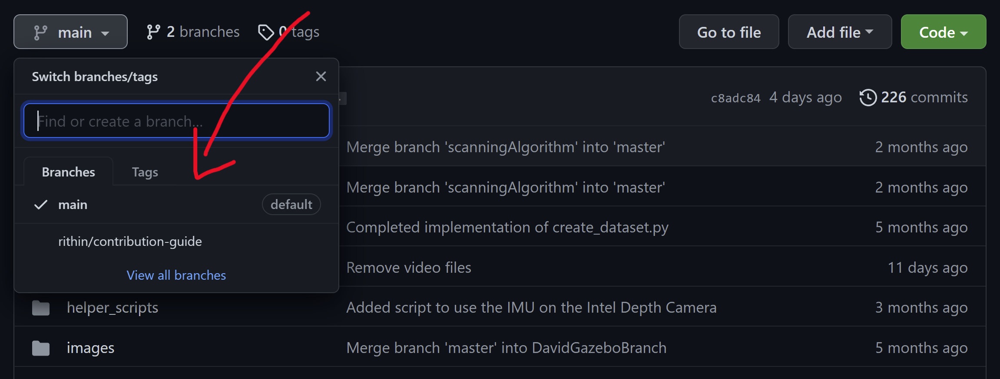
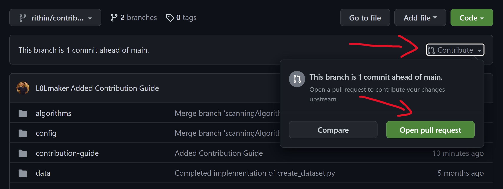

# Contributing to Navigation

## Branching

### When to Branch
When you begin working on a new feature/change, the first thing you will want to do is 
create a branch to handle the new code changes relating to the feature/change. 

### How to Branch

Switch to the `main` branch and pull the latest changes:

`git checkout main`

`git pull`

Then, you can create a branch from the latest version of `main`:

`git checkout -b <new_branch> main`

### Branching Naming Conventions

For easier usability, it is crucial to use a correct naming convention while branching. The naming scheme we
will follow looks like this:

`<name-of-person>/<short-description-of-feature>`

For example, if I(Rithin) wanted to 
implement an end of row turning algorithm, I would make a branch called `rithin/end-of-row-alg` and push my work to 
this branch as it develops.

## Pull Requests
When your code is implemented and ready for review, you will need to open a PR(Pull Request) on GitHub.

Step 1: Switch to your branch view

Step 2: Locate the `Contribute` button on your branch and Open a PR

Your code can now be reviewed by the team!
